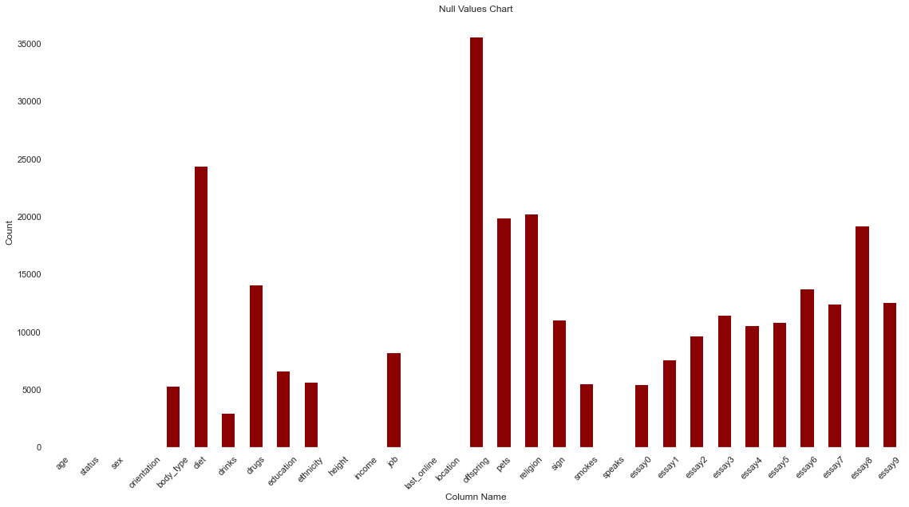

# Exploring OkCupid Profiles
Dating Web Site EDA

### Table of Contents
1. [Overview](#overview)
2. [The Data Set](#the-data-set)
3. [Cleaning the data](#cleaning-the-data)
4. [End Goal Questions](#end-goal-questions)
5. [Data Analysis and Visualization](#data-analysis-and-visualization)
6. [Further Data Analysis](#further-data-analysis)
7. [Conclusion](#conclusion)
8. [Credits and References](#credits-and-references)

## **Overview**
OkCupid is a U.S.-based, international operating online dating, friendship, and formerly also a social networking website and application. It was launched in January 19th, 2004 by a group a developers from Harvard University. It is currently owned by Match Group which also owns Tinder, Hinge, Plenty of Fish and many other popular dating apps and sites. 

OkCupid is a dating platform that is similiar to other dating app such as Tinder, but rather provided a game feel dating app, it also feels like a social networking sites. OkCupid is considered to be a dating platform designed to be less centered on physical appearance. Despite that facts, the dating world however proving a rather otherwise picture. We are in this data exploring quest, mainly focus on its data and graph.
## **The Data Set**
This dataset was created with the use of a python script that pulled the data from public profiles on www.okcupid.com. It compromises of 59946 user profiles, which only includes people within a 25 mile radius of San Francisco. 

The dataset categorize user profiles with 31 different columns: 
- 21 of which columns are user's natural consistent attribute (things that biographically distingushed between person) such as a person's `age`, `sex`, `height`, `education`, `ethnicity`, `speaks`, ... etc. The full table is at below:

- 10 of which columns in the name of `essay0`, `essay1`, `essay2`, ... `essay9` etc. are pre-made questions that a user could answer in which to make their profiles stand out and unique with purpose of attracting soul-mates. OkCupid engine also use this data to find and/or recommend matchs, such finding might be outside the scope of this analysis. The meaning of each "essay" columns is listed as below:

<table>
<tr><td>

| Column Name | Data Type |
|-------------|-----------|
| age         | int64     |
| status      | object    |
| sex         | object    |
| orientation | object    |
| body_type   | object    |
| diet        | object    |
| drinks      | object    |
| drugs       | object    |
| education   | object    |
| ethnicity   | object    |
| height      | float64   |
| income      | int64     |
| job         | object    |
| last_online | object    |
| location    | object    |
| offspring   | object    |
| pets        | object    |
| religion    | object    |
| sign        | object    |
| smokes      | object    |
| speaks      | object    |

</td><td>

| Column name | Meaning                                        |
|-------------|------------------------------------------------|
| essay0      | My self summary                                |
| essay1      | What I’m doing with my life                    |
| essay2      | I’m really good at                             |
| essay3      | The first thing people usually notice about me |
| essay4      | Favorite books, movies, show, music, and food  |
| essay5      | The six things I could never do without        |
| essay6      | I spend a lot of time thinking about           |
| essay7      | On a typical Friday night I am                 |
| essay8      | The most private thing I am willing to admit   |
| essay9      | You should message me if...                    |

</td></tr> </table>

***NOTE: Due to Github upload file size restriction, the dataset is not included in this repository but it can be downloaded at [`okcupid_profiles.csv`](https://www.kaggle.com/code/captainqq/dating-profiles-analysis-and-visualization/data). After downloading, be sure to save it in the `data` folder.

## **Cleaning the data**
1. Process null values
    - I found a chunk amount of `nan` values across the datafram using `.isnull().sum()`, ~~using `.fillna('')` to replace them with an empty string `''`. This one is particularly helpful to me later down the data exploring path as I found out some of the `nan` value is considers `float`, and it gave error when I am trying to dealing with a `string` column.~~
        - the `nan` values threw me a few datatype error when iterate through string values. I have used `str()` method to escape `float` data type error.
        - the `nan` values also return a `nan` value when I try to combine `str` values with `nan` values. I have used `.astype()` to avoid spoiling the data.

2. Processing -1 values
    - Changed them to nan values.
2. Check for dupliated row
    - Found none.
3. Combined possible similar data without compromised the data integrity, to reduce number of labels
    - Generalize the `education` column. Using the table showed as below
    - Make no change to `ethnicity` column 
    - Combine all "essays" columns into `all_essays` column
    - Removing `locations` and `last_online` column
    - Creating columns `words` counting how many words a person typing

## **End Goal Questions**
1. What is the demographic of people using dating web site?
2. Where is the vietnamese group of people?
3. What are top words and their occurences (excluding english stop words)?
## **Data Analysis and Visualization**

Gender Graph (%)

Gender/Age Graph (%)

Status Graph (%)

Orientation Pie (%)

Gender/Education Graph 

Gender/Words

Education/Words

Job/Words

Other ethnicity/Speak Vietnamese

## **Further Data Analysis**
## **Conclusion**
## **Credits and References**
https://github.com/rudeboybert/JSE_OkCupid

https://www.kaggle.com/datasets/andrewmvd/okcupid-profiles

https://sparkbyexamples.com/pandas/pandas-remap-values-in-column-with-a-dictionary-dict/

https://www.geeksforgeeks.org/python-program-to-convert-a-tuple-to-a-string/

https://theprogrammingexpert.com/remove-parentheses-from-string-python/